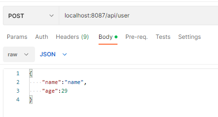

#项目说明
[timeCharacteristic说明](flink图解说明/flink_timeCharacteristic详解.md)

[flink_api说明](flink图解说明/flink_api.md)

##目录结构
```
|-- undefined
|-- java
|   |-- com
|       |-- bigdata
|           |-- springbootkafkaflink
|               |-- SpringbootKafkaFlinkApplication.java
|               |-- config
|               |   |-- ApplicationConfiguration.java
|               |   |-- MasterDataSourceConfig.java
|               |   |-- package-info.java
|               |-- constant
|               |   |-- Constants.java
|               |   |-- package-info.java
|               |-- dao
|               |   |-- package-info.java
|               |   |-- UserDao.java
|               |-- flink                           =====>> flink相关操作主要目录
|               |   |-- MysqlKafkaSource.java
|               |   |-- MysqlSinkMultiparty.java
|               |   |-- MySQLSinkSingle.java
|               |-- flinkTrigger                    =====>> flink 触发器
|               |   |-- CountWithTimeoutTrigger.java
|               |-- kafka
|               |   |-- KafkaProducerUtil.java
|               |   |-- package-info.java
|               |   |-- demo
|               |       |-- KafkaConsumerTest.java
|               |       |-- KafkaProducerTest.java
|               |       |-- package-info.java
|               |-- pojo
|               |   |-- package-info.java
|               |   |-- User.java
|               |-- service
|               |   |-- package-info.java
|               |   |-- UserService.java
|               |   |-- impl
|               |       |-- package-info.java
|               |       |-- UserServiceImpl.java
|               |-- web
|                   |-- package-info.java
|                   |-- UserRestController.java    =====>> 项目演示可使用postMan请求 localhost:8087/api/user 具体参考如下：
|-- resources
|-- application.properties
|-- flink_help.md
|-- logback.xml
|-- package-lock.json
|-- flink图解说明
|   |-- 图片资源
|-- mapper
|   |-- UserMapper.xml
|-- sql
|-- sql.sql
```
###请求演示

