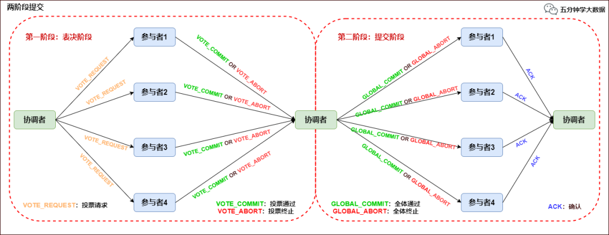

##分布式提交的问题
在分布式系统中，为了保证数据的高可用，通常会将数据保留多个副本(replica)，这些副本会放置在不同的物理的机器上。
在数据有多份副本的情况下，如果网络、服务器或者软件出现故障，会导致部分副本写入成功，部分副本写入失败。这就造成各个副本之间的数据不一致，数据内容冲突，造成事实上的数据不一致。

##解决思路
可以看到，这里出现问题的主要原因是多个副本之间没有同步机制，可以增加一个协调机制来解决数据不一致问题。下面介绍的两阶段提交和三阶段提交都是通过引入一个协调者来进行协调。

##两阶段提交协议（2PC）

两阶段提交协议（Two－Phase Commit，2PC）是很常用的解决分布式事务问题的方式，它可以保证在分布式事务中，要么所有参与进程都提交事务，要么都取消，即实现 ACID 中的 A （原子性）。

在数据一致性的环境下，其代表的含义是：要么所有备份数据同时更改某个数值，要么都不改，以此来达到数据的强一致性。

两阶段提交协议中有两个重要角色，协调者（Coordinator）和参与者（Participant），其中协调者只有一个，起到分布式事务的协调管理作用，参与者有多个。

顾名思义，两阶段提交将提交过程划分为连续的两个阶段：表决阶段（Voting）和提交阶段（Commit）。

两阶段提交协议过程如下图所示：

##解决了哪些问题
在正常的情况下，如果第一阶段某些参与者出现问题，那么其他所有参与者都能够知道事务失败了，可以执行取消操作，数据保持了一致性。
如果所有的参与者都能够执行成功，那么在提交阶段，所有事务提交，数据也是一致的

##还有哪些问题
1. 阻塞
在请求和提交阶段都是阻塞的，多个参与者都要进行决策，阻塞时间边长，如果出现网络问题，长时间等待阻塞。
2. 单点故障
协调者的作用非常重要，协调者挂了，参与者长期阻塞。
3. 不一致
如果协调者在提交阶段中间挂了，某些参与者收到了提交命令，某些参与者没有收到，还是会出现数据不一致情况。

##三阶段提交
###概述
三阶段提交协议在协调者和参与者中都引入超时机制，并且把两阶段提交协议的第一个阶段分成了两步: 询问，然后再锁资源，最后真正提交。

    1. canCommit阶段
    协调者向参与者发送commit请求，参与者如果可以提交就返回yes响应，否则返回no响应
    2. preCommit阶段
        1.协调者根据参与者canCommit阶段的响应来决定是否可以继续事务的preCommit操作。根据响应情况，有下面两种可能:
            协调者从所有参与者得到的反馈都是yes:
            那么进行事务的预执行，协调者向所有参与者发送preCommit请求，并进入prepared阶段。
            参与者接收到preCommit请求后会执行事务操作，并将undo和redo信息记录到事务日志中。
            如果一个参与者成功地执行了事务操作，则返回ACK响应，同时开始等待最终指令。
        2.协调者从所有参与者得到的反馈有一个是No或是等待超时之后协调者都没收到响应:
            那么就要中断事务，协调者向所有的参与者发送abort请求。
            参与者在收到来自协调者的abort请求，或超时后仍未收到协调者请求，执行事务中断。
    3. doCommit阶段
      协调者根据参与者preCommit阶段的响应来决定是否可以继续事务的doCommit操作。根据响应情况，有下面两种可能:
        1.协调者从参与者得到了ACK的反馈:
            协调者接收到参与者发送的ACK响应，那么它将从预提交状态进入到提交状态，并向所有参与者发送doCommit请求。
            参与者接收到doCommit请求后，执行正式的事务提交，并在完成事务提交之后释放所有事务资源，并向协调者发送haveCommitted的ACK响应。
            协调者收到这个ACK响应之后，完成任务。
        2.协调者从参与者没有得到ACK的反馈, 也可能是接收者发送的不是ACK响应，也可能是响应超时:
        执行事务中断。
解决了哪些问题
1. 减少阻塞
2. 如果第一个阶段，参与者挂了，或者协调者挂了，最终数据都是一致的，因为超时机制，也不会一直等待。

还有哪些问题

如果进入PreCommit后，Coordinator发出的是abort请求，假设只有一个Cohort收到并进行了abort操作，而其他对于系统状态未知的Cohort会根据3PC选择继续Commit，此时系统状态发生不一致性。