#Flink从入门到入土（详细教程）
和其他所有的计算框架一样，flink也有一些基础的开发步骤以及基础，核心的API，从开发步骤的角度来讲，主要分为四大部分

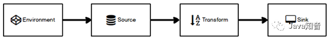

##1.Environment
Flink Job在提交执行计算时，需要首先建立和Flink框架之间的联系，也就指的是当前的flink运行环境，只有获取了环境信息，才能将task调度到不同的taskManager执行。而这个环境对象的获取方式相对比较简单
```
// 批处理环境
val env = ExecutionEnvironment.getExecutionEnvironment
// 流式数据处理环境
val env = StreamExecutionEnvironment.getExecutionEnvironment
```

##2.Source

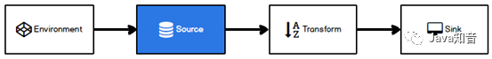

Flink框架可以从不同的来源获取数据，将数据提交给框架进行处理, 我们将获取数据的来源称之为数据源.
###2.1.从集合读取数据
一般情况下，可以将数据临时存储到内存中，形成特殊的数据结构后，作为数据源使用。这里的数据结构采用集合类型是比较普遍的

```
import org.apache.flink.streaming.api.scala._

/**
* description: SourceList
* date: 2020/8/28 19:02
* version: 1.0
*
*         类的说明：从集合读取数据
*/
object SourceList {
def main(args: Array[String]): Unit = {
//1.创建执行的环境
val env: StreamExecutionEnvironment = StreamExecutionEnvironment.getExecutionEnvironment
    //2.从集合中读取数据
    val sensorDS: DataStream[WaterSensor] = env.fromCollection(
      // List(1,2,3,4,5)
      List(
        WaterSensor("ws_001", 1577844001, 45.0),
        WaterSensor("ws_002", 1577844015, 43.0),
        WaterSensor("ws_003", 1577844020, 42.0)
      )
    )
    //3.打印
    sensorDS.print()
    //4.执行
    env.execute("sensor")
}
/**
* 定义样例类：水位传感器：用于接收空高数据
*
* @param id 传感器编号
* @param ts 时间戳
* @param vc 空高
  */
  case class WaterSensor(id: String, ts: Long, vc: Double)
  }
```
###2.2从文件中读取数据
通常情况下，我们会从存储介质中获取数据，比较常见的就是将日志文件作为数据源
```
import org.apache.flink.streaming.api.scala._
/**
* description: SourceList
* date: 2020/8/28 19:02
* version: 1.0
*
*         类的说明：从文件读取数据
*/
object SourceFile {
def main(args: Array[String]): Unit = {
//1.创建执行的环境
val env: StreamExecutionEnvironment = StreamExecutionEnvironment.getExecutionEnvironment
//2.从指定路径获取数据
val fileDS: DataStream[String] = env.readTextFile("input/data.log")
    //3.打印
    fileDS.print()
    //4.执行
    env.execute("sensor")
}
}
/**
* 在读取文件时，文件路径可以是目录也可以是单一文件。如果采用相对文件路径，会从当前系统参数user.dir中获取路径
* System.getProperty("user.dir")
  */
  /**
* 如果在IDEA中执行代码，那么系统参数user.dir自动指向项目根目录，
* 如果是standalone集群环境, 默认为集群节点根目录，当然除了相对路径以外，
* 也可以将路径设置为分布式文件系统路径，如HDFS
  val fileDS: DataStream[String] =
  env.readTextFile( "hdfs://hadoop02:9000/test/1.txt")
  */
```
##3.Transform

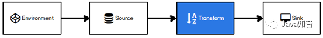

在Spark中，算子分为转换算子和行动算子，转换算子的作用可以通过算子方法的调用将一个RDD转换另外一个RDD，Flink中也存在同样的操作，可以将一个数据流转换为其他的数据流。

转换过程中，数据流的类型也会发生变化，那么到底Flink支持什么样的数据类型呢，其实我们常用的数据类型，Flink都是支持的。比如：Long, String, Integer, Int, 元组，样例类，List, Map等。

###3.1 map
* 映射：将数据流中的数据进行转换, 形成新的数据流，消费一个元素并产出一个元素
* 参数：Scala匿名函数或MapFunction
* 返回：DataStream
```
import org.apache.flink.streaming.api.scala._
/**
* description: SourceList
* date: 2020/8/28 19:02
* version: 1.0
*         类的说明：从集合读取数据
*/
object Transfrom_map {
def main(args: Array[String]): Unit = {
//1.创建执行的环境
val env: StreamExecutionEnvironment = StreamExecutionEnvironment.getExecutionEnvironment
    //2.从集合中读取数据
    val sensorDS: DataStream[WaterSensor] = env.fromCollection(
      // List(1,2,3,4,5)
      List(
        WaterSensor("ws_001", 1577844001, 45.0),
        WaterSensor("ws_002", 1577844015, 43.0),
        WaterSensor("ws_003", 1577844020, 42.0)
      )
    )
    val sensorDSMap = sensorDS.map(x => (x.id+"_1",x.ts+"_1",x.vc + 1))
    //3.打印
    sensorDSMap.print()
    //4.执行
    env.execute("sensor")
}
/**
* 定义样例类：水位传感器：用于接收空高数据
*
* @param id 传感器编号
* @param ts 时间戳
* @param vc 空高
  */
  case class WaterSensor(id: String, ts: Long, vc: Double)
}
```

####3.1.1 MapFunction
Flink为每一个算子的参数都至少提供了Scala匿名函数和函数类两种的方式，其中如果使用函数类作为参数的话，需要让自定义函数继承指定的父类或实现特定的接口。例如：MapFunction
```
sensor-data.log [文件数据]
sensor_1,1549044122,10
sensor_1,1549044123,20
sensor_1,1549044124,30
sensor_2,1549044125,40
sensor_1,1549044126,50
sensor_2,1549044127,60
sensor_1,1549044128,70
sensor_3,1549044129,80
sensor_3,1549044130,90
sensor_3,1549044130,100
```
```
import org.apache.flink.api.common.functions.MapFunction
import org.apache.flink.streaming.api.scala._
/**
* description: SourceList
* date: 2020/8/28 19:02
* version: 1.0
*         类的说明：从文件读取数据
*/
object Transform_MapFunction {
def main(args: Array[String]): Unit = {
//1.创建执行的环境
val env: StreamExecutionEnvironment = StreamExecutionEnvironment.getExecutionEnvironment
//2.从指定路径获取数据
val sensorDS: DataStream[String] = env.readTextFile("input/sensor-data.log")
     sensorDS.map()
    //3.打印
//  MapDS.print()
    //4.执行
    env.execute("map")
}
/**
* 自定义继承 MapFunction
* MapFunction[T,O]
* 自定义输入和输出
*/
class MyMapFunction extends MapFunction[String,WaterSensor]{
override def map(t: String): WaterSensor = {
      val datas: Array[String] = t.split(",")
      WaterSensor(datas(0),datas(1).toLong,datas(2).toInt)
    }
}
/**
* 定义样例类：水位传感器：用于接收空高数据
*
* @param id 传感器编号
* @param ts 时间戳
* @param vc 空高
  */
  case class WaterSensor(id: String, ts: Long, vc: Double)

}
```

####3.1.2 RichMapFunction
所有Flink函数类都有其Rich版本。它与常规函数的不同在于，可以获取运行环境的上下文，并拥有一些生命周期方法，所以可以实现更复杂的功能。也有意味着提供了更多的，更丰富的功能。例如：RichMapFunction

sensor-data.log 文件数据 同上一致
```
import org.apache.flink.api.common.functions.{MapFunction, RichMapFunction}
import org.apache.flink.configuration.Configuration
import org.apache.flink.streaming.api.scala._
/**
* description: SourceList
* date: 2020/8/28 19:02
* version: 1.0
*         类的说明：从文件读取数据
*/
object Transform_RichMapFunction {
def main(args: Array[String]): Unit = {
//1.创建执行的环境
val env: StreamExecutionEnvironment = StreamExecutionEnvironment.getExecutionEnvironment
//2.从指定路径获取数据
val sensorDS: DataStream[String] = env.readTextFile("input/sensor-data.log")
    val myMapDS: DataStream[WaterSensor] = sensorDS.map(new MyRichMapFunction)
    //3.打印
    myMapDS.print()
    //4.执行
    env.execute("map")
}
/**
* 自定义继承 MapFunction
* MapFunction[T,O]
* 自定义输入和输出
*
*/
class MyRichMapFunction extends RichMapFunction[String,WaterSensor]{
    override def map(value: String): WaterSensor = {
      val datas: Array[String] = value.split(",")
      //      WaterSensor(datas(0), datas(1).toLong, datas(2).toInt)
      WaterSensor(getRuntimeContext.getTaskName, datas(1).toLong, datas(2).toInt)
    }
    // 富函数提供了生命周期方法
    override def open(parameters: Configuration): Unit = {}
    override def close(): Unit = {}
}
/**
* 定义样例类：水位传感器：用于接收空高数据
*
* @param id 传感器编号
* @param ts 时间戳
* @param vc 空高
  */
  case class WaterSensor(id: String, ts: Long, vc: Double)
}
```
Rich Function有一个生命周期的概念。典型的生命周期方法有：

* open()方法是rich function的初始化方法，当一个算子例如map或者filter被调 用之前open()会被调用
* close()方法是生命周期中的最后一个调用的方法，做一些清理工作
* getRuntimeContext()方法提供了函数的RuntimeContext的一些信息，例如函数执行         的并行度，任务的名字，以及state状态
####3.1.3 flatMap
* 扁平映射：将数据流中的整体拆分成一个一个的个体使用，消费一个元素并产生零到多个元素
* 参数：Scala匿名函数或FlatMapFunction
* 返回：DataStream


```
import org.apache.flink.streaming.api.scala._
/**
* description: SourceList
* date: 2020/8/28 19:02
* version: 1.0
*         类的说明：FlatMap
*/
object Transform_FlatMap {
def main(args: Array[String]): Unit = {
    // 1.创建执行环境
    val env: StreamExecutionEnvironment = StreamExecutionEnvironment.getExecutionEnvironment
    env.setParallelism(1)
    // 2.读取数据
    val listDS: DataStream[List[Int]] = env.fromCollection(
      List(
        List(1, 2, 3, 4),
        List(5, 6, 7,1,1,1)
      )
    )
    val resultDS: DataStream[Int] = listDS.flatMap(list => list)
    resultDS.print()
    // 4. 执行
    env.execute()
  }
}
```
###3.2. filter
* 过滤：根据指定的规则将满足条件（true）的数据保留，不满足条件(false)的数据丢弃
* 参数：Scala匿名函数或FilterFunction
* 返回：DataStream
```
import org.apache.flink.streaming.api.scala._
/**
 * description: SourceList
 * date: 2020/8/28 19:02
 * version: 1.0
 *         类的说明：Filter
 */
object Transform_Filter {
  def main(args: Array[String]): Unit = {
    // 1.创建执行环境
    val env: StreamExecutionEnvironment = StreamExecutionEnvironment.getExecutionEnvironment
    env.setParallelism(1)
    // 2.读取数据
    val listDS: DataStream[List[Int]] = env.fromCollection(
      List(
        List(1, 2, 3, 4,1, 2, 3, 4),
        List(5, 6, 7,1,1,1,1, 2, 3, 4,1, 2, 3, 4),
        List(1, 2, 3, 4),
        List(5, 6, 7,1,1,1),
        List(1, 2, 3, 4),
        List(5, 6, 7,1,1,1)
      )
    )
    // true就留下，false就抛弃
    listDS.filter(num => {
      num.size>5
      })
      .print("filter")
    // 4. 执行
    env.execute()
  }
}
```
##3.3 keyBy
在Spark中有一个GroupBy的算子，用于根据指定的规则将数据进行分组，在flink中也有类似的功能，那就是keyBy，根据指定的key对数据进行分流

* 分流：根据指定的Key将元素发送到不同的分区，相同的Key会被分到一个分区（这里分区指的就是下游算子多个并行节点的其中一个）。keyBy()是通过哈希来分区的
* 参数：Scala匿名函数或POJO属性或元组索引，不能使用数组
* 返回：KeyedStream


```
import org.apache.flink.streaming.api.scala._
/**
 * description: SourceList
 * date: 2020/8/28 19:02
 * version: 1.0
 *         类的说明：FlatMap
 */
object Transform_KeyBy {
  def main(args: Array[String]): Unit = {
    // 1.创建执行环境
    val env: StreamExecutionEnvironment = StreamExecutionEnvironment.getExecutionEnvironment
    env.setParallelism(1)
    // 2.读取数据
    val sensorDS: DataStream[String] = env.readTextFile("input/sensor-data.log")
    //3.转换为样例类
    val mapDS = sensorDS.map(
      lines => {
        val datas = lines.split(",")
        WaterSensor(datas(0), datas(1).toLong, datas(2).toInt)
      }
    )
    // 4. 使用keyby进行分组
    // TODO 关于返回的key的类型：
    // 1. 如果是位置索引 或 字段名称 ，程序无法推断出key的类型，所以给一个java的Tuple类型
    // 2. 如果是匿名函数 或 函数类 的方式，可以推断出key的类型，比较推荐使用
    // *** 分组的概念：分组只是逻辑上进行分组,打上了记号(标签)，跟并行度没有绝对的关系
    //      同一个分组的数据在一起（不离不弃）
    //      同一个分区里可以有多个不同的组

    //        val sensorKS: KeyedStream[WaterSensor, Tuple] = mapDS.keyBy(0)
    //    val sensorKS: KeyedStream[WaterSensor, Tuple] = mapDS.keyBy("id")
    val sensorKS: KeyedStream[WaterSensor, String] = mapDS.keyBy(_.id)
    //    val sensorKS: KeyedStream[WaterSensor, String] = mapDS.keyBy(
    //      new KeySelector[WaterSensor, String] {
    //        override def getKey(value: WaterSensor): String = {
    //          value.id
    //        }
    //      }
    //    )
    sensorKS.print().setParallelism(5)
    // 4. 执行
    env.execute()
  }
  /**
   * 定义样例类：水位传感器：用于接收空高数据
   *
   * @param id 传感器编号
   * @param ts 时间戳
   * @param vc 空高
   */
  case class WaterSensor(id: String, ts: Long, vc: Double)
}
```
###3.4 shuffle
* 打乱重组（洗牌）：将数据按照均匀分布打散到下游
* 参数：无
* 返回：DataStream

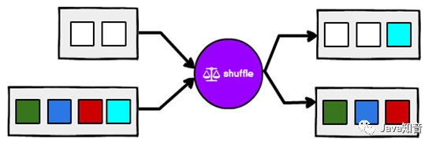

```
import org.apache.flink.streaming.api.scala._
/**
 * description: SourceList
 * date: 2020/8/28 19:02
 * version: 1.0
 *         类的说明：FlatMap
 */
object Transform_Shuffle {
  def main(args: Array[String]): Unit = {
    // 1.创建执行环境
    val env: StreamExecutionEnvironment = StreamExecutionEnvironment.getExecutionEnvironment
    env.setParallelism(1)
    // 2.读取数据
    val sensorDS: DataStream[String] = env.readTextFile("input/sensor-data.log")
    val shuffleDS = sensorDS.shuffle
    sensorDS.print("data")
    shuffleDS.print("shuffle")
    // 4. 执行
    env.execute()
  }
}
```
###3.5 split
在某些情况下，我们需要将数据流根据某些特征拆分成两个或者多个数据流，给不同数据流增加标记以便于从流中取出。

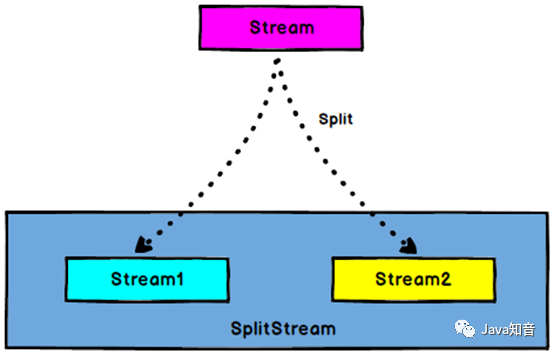

需求：将水位传感器数据按照空高高低（以40cm,30cm为界），拆分成三个流
```
import org.apache.flink.streaming.api.scala._
/**
 * description: SourceList
 * date: 2020/8/28 19:02
 * version: 1.0
 *         类的说明：FlatMap
 */
object Transform_Split {
  def main(args: Array[String]): Unit = {
    // 1.创建执行环境
    val env: StreamExecutionEnvironment = StreamExecutionEnvironment.getExecutionEnvironment
    env.setParallelism(1)
    // 2.读取数据
    val sensorDS: DataStream[String] = env.readTextFile("input/sensor-data.log")
    // 3.转换成样例类
    val mapDS: DataStream[WaterSensor] = sensorDS.map(
      lines => {
        val datas: Array[String] = lines.split(",")
        WaterSensor(datas(0), datas(1).toLong, datas(2).toInt)
      }
    )
    val splitSS: SplitStream[WaterSensor] = mapDS.split(
      sensor => {
        if (sensor.vc < 40) {
          Seq("normal")
        } else if (sensor.vc < 80) {
          Seq("Warn")
        } else {
          Seq("alarm")
        }
      }
    )
    // 4. 执行
    env.execute()
  }
  /**
   * 定义样例类：水位传感器：用于接收空高数据
   *
   * @param id 传感器编号
   * @param ts 时间戳
   * @param vc 空高
   */
  case class WaterSensor(id: String, ts: Long, vc: Double)
}
```
###3.6 select
将数据流进行切分后，如何从流中将不同的标记取出呢，这时就需要使用select算子了。

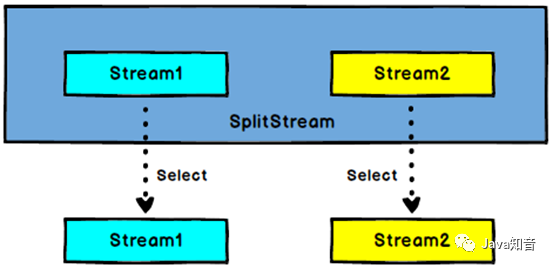

###3.7 connect
在某些情况下，我们需要将两个不同来源的数据流进行连接，实现数据匹配，比如订单支付和第三方交易信息，这两个信息的数据就来自于不同数据源，连接后，将订单支付和第三方交易信息进行对账，此时，才能算真正的支付完成。

Flink中的connect算子可以连接两个保持他们类型的数据流，两个数据流被Connect之后，只是被放在了一个同一个流中，内部依然保持各自的数据和形式不发生任何变化，两个流相互独立

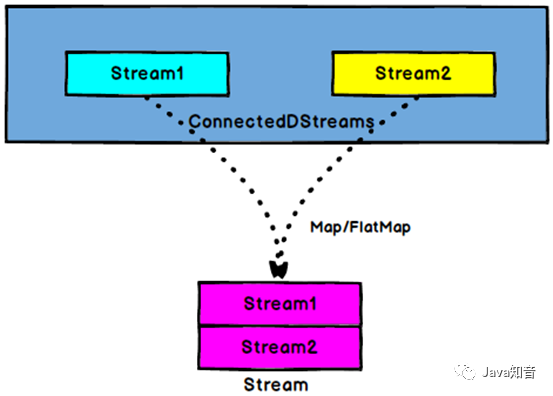

###3.8 union
对两个或者两个以上的DataStream进行union操作，产生一个包含所有DataStream元素的新DataStream

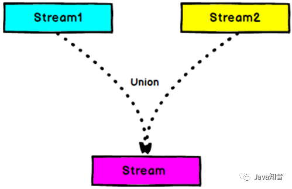

connect与 union 区别：

1. nion之前两个流的类型必须是一样，connect可以不一样
2. connect只能操作两个流，union可以操作多个。
###3.9 Operator
   Flink作为计算框架，主要应用于数据计算处理上， 所以在keyBy对数据进行分流后，可以对数据进行相应的统计分析

####3.9.1 滚动聚合算子（Rolling Aggregation）
这些算子可以针对KeyedStream的每一个支流做聚合。执行完成后，会将聚合的结果合成一个流返回，所以结果都是DataStream
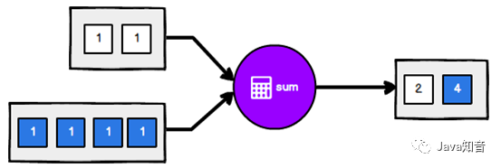

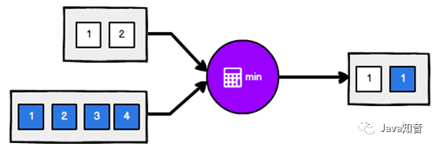

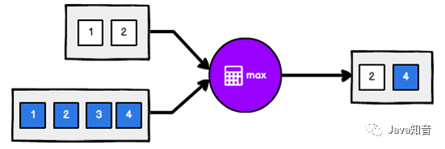

####3.9.2 reduce
一个分组数据流的聚合操作，合并当前的元素和上次聚合的结果，产生一个新的值，返回的流中包含每一次聚合的结果，而不是只返回最后一次聚合的最终结果。

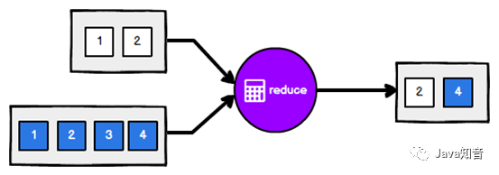

###3.9.3process
Flink在数据流通过keyBy进行分流处理后，如果想要处理过程中获取环境相关信息，可以采用process算子自定义实现 1)继承KeyedProcessFunction抽象类，并定义泛型：[KEY, IN, OUT]
```
class MyKeyedProcessFunction extends KeyedProcessFunction[String, WaterSensor, String]{}
重写方法
// 自定义KeyedProcessFunction,是一个特殊的富函数
  // 1.实现KeyedProcessFunction，指定泛型：K - key的类型， I - 上游数据的类型， O - 输出的数据类型
  // 2.重写 processElement方法，定义 每条数据来的时候 的 处理逻辑
/**
      * 处理逻辑：来一条处理一条
      *
      * @param value 一条数据
      * @param ctx   上下文对象
      * @param out   采集器：收集数据，并输出
      */
    override def processElement(value: WaterSensor, ctx: KeyedProcessFunction[String, WaterSensor, String]#Context, out: Collector[String]): Unit = {
      out.collect("我来到process啦，分组的key是="+ctx.getCurrentKey+",数据=" + value)
      // 如果key是tuple，即keyby的时候，使用的是 位置索引 或 字段名称，那么key获取到是一个tuple
//      ctx.getCurrentKey.asInstanceOf[Tuple1].f0 //Tuple1需要手动引入Java的Tuple
    }
```
##4.Sink

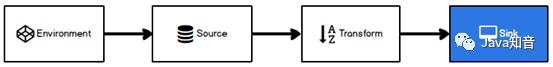
Sink有下沉的意思，在Flink中所谓的Sink其实可以表示为将数据存储起来的意思，也可以将范围扩大，表示将处理完的数据发送到指定的存储系统的输出操作

之前我们一直在使用的print方法其实就是一种Sink。
```
@PublicEvolving
public DataStreamSink<T> print(String sinkIdentifier) {
PrintSinkFunction<T> printFunction = new PrintSinkFunction(sinkIdentifier, false);
return this.addSink(printFunction).name("Print to Std. Out");
}
```
官方提供了一部分的框架的sink。除此以外，需要用户自定义实现sink

https://www.cnblogs.com/javazhiyin/p/13597319.html