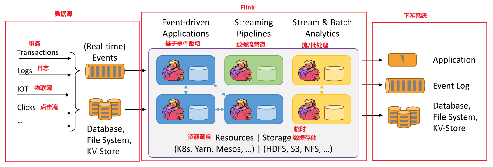
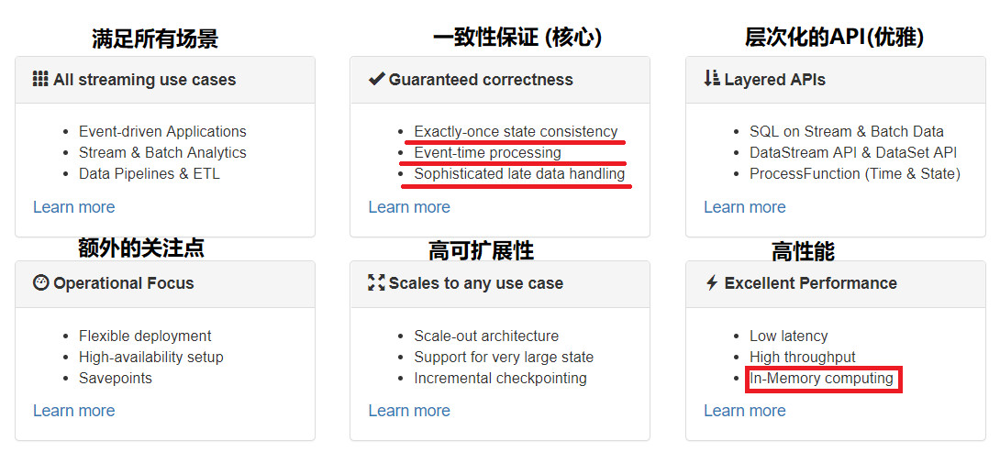

#Flink应用场景

##背景
    Flink诞生于欧洲的一个大数据研究项目StratoSphere。该项目是柏林工业大学的一个研究性项目。早期，Flink 是做 Batch 计算的，但是在 2014 年，
    StratoSphere 里面的核心成员孵化出 Flink，同年将 Flink 捐赠 Apache，并在后来成为 Apache 的顶级大数据项目，同时 Flink 计算的主流方向被定位为 Streaming，即用流式计算来做所有大数据的计算。
##场景    
    大量数据在不断地产生,以及我们熟悉的网络流量监控、服务器产生的日志数据，这些数据最大的共同点就是实时从不同的数据源中产生等。
##名词
    无界流：    有一个开始但是没有结束，不会在生成时终止并提供数据，必须连续处理无界流，也就是说必须在获取后立即处理event。对于无界数据流我们无法等待所有数据都到达，因为输入是无界的，并且在任何时间点都不会完成。处理无界数据流通常要求以特定顺序（例如事件发生的顺序）获取event，以便能够推断结果完整性。
    有界数据流：有界数据流有明确定义的开始和结束，可以在执行任何计算之前通过获取所有数据来处理有界流，处理有界流不需要有序获取，因为可以始终对有界数据集进行排序，有界流的处理也称为批处理。
    批处理：    对有界数据流的处理通常被称为批处理。批处理不需要有序地获取数据。在批处理模式下，首先将数据流持久化到存储系统（文件系统或对象存储）中，然后对整个数据集的数据进行读取、排序、统计或汇总计算，最后输出结果
    流处理：    对于无界数据流，通常在数据生成时进行实时处理。因为无界数据流的数据输入是无限的，所以必须持续地处理。数据被获取后需要立刻处理，不可能等到所有数据都到达后再进行处理。处理无界数据流通常要求以特定顺序（如事件发生的顺序）获取事件，以便能够保证推断结果的完整性
    算子：     建议阅读说明
####流处理/批处理
    批处理的特点是有界、持久、大量，非常适合需要访问全套记录才能完成的计算工作，一般用于离线统计。
    流处理的特点是无界、实时, 无需针对整个数据集执行操作，而是对通过系统传输的每个数据项执行操作，一般用于实时统计。
##流式处理引擎三种：
最多一次、至少一次、精确一次。
* 最多一次（At-most-Once）：用户的数据只会被处理一次，不管成功还是失败，不会重试也不会重发。
* 至少一次（At-least-Once）：系统会保证数据或事件至少被处理一次。如果中间发生错误或者丢失，那么会从源头重新发送一条然后进入处理系统，所以同一个事件或者消息会被处理多次。
* 精确一次（Exactly-Once）：表示每一条数据只会被精确地处理一次，不多也不少。
##四代计算引擎的比较
    计算方式

    MapReduce：批处理引擎，为其他计算引擎提供了大数据处理的核心思想，即map、reduce
    Storm：流计算引擎，为了满足更高的实效性而产生
    Spark：集流式处理和批处理于一身的统一的计算引擎，基于内存计算，提高了性能
    Flink：集流式处理和批处理于一身的统一的计算引擎，吸收了以上3个框架的优点并改进后的计算框架

    为什么Flink会产生？

    MapReduce作为初代计算引擎，它最大的价值在于提供了一种分布式计算的核心思想，map和reduce。但随着业务中海量的无限(界)数据越来越普遍，使用为无限(界)数据流处理而设计的系统处理数据的场景越来越多
    于是Storm应运而生，但是作为第一代的流式计算引擎，Storm有以下缺点：
        1. 使用Clojure（基于JVM）语言开发，这意味着你如果想看看源码，可能得多学一门语言
        2. Storm本身还存在一些bug，生产上发生过集群崩溃的事件
        3. 不具备一些流处理中需要的高级功能，例如exactly-once等.

    Spark集批处理，流处理，SQL功能，图计算，机器学习于一身，并且支持SparkR和PySpark来做科学计算，可以说是当下最完美的一套计算引擎，基于内存的计算大大提高了计算效率，目前社区活跃度很高，是目前最流行的计算引擎。
    Flink与Spark类似，具有Spark拥有的全部功能，那么在有Spark的前提下，我们为什么还需要Flink？？？

    Spark与Flink最大的不同在于核心理念的不同，Spark所有的组件都是基于它的核心模块SparkCore而开发，而SparkCore是用于批处理的，Spark认为，批处理是数据处理的常态，把流处理作为批处理的一种特殊情况来看待，于是，SparkStreaming是利用连续的微批处理来模拟实时处理。
    而Flink认为，流处理是常态，批处理是流处理的一种特殊情况，在无界流中去某段范围内的全量数据进行处理就是批处理，于是Flink把核心放在流处理上，实现了一些高级的也是必须的功能，例如数据状态、事件时间、分布式快照、watermark等
##flink介绍
执行图

核心特性

Flink核心四大基石

    Checkpoint  --> https://blog.csdn.net/ytp552200ytp/article/details/125196572 
        保证 Flink 任务运行突然失败时，能够从最近 Checkpoint 进行状态恢复启动，进行错误容忍。是一种自动容错机制，而不是具体的状态存储镜像。Flink Checkpoint 是一种容错恢复机制。
        在介绍 Checkpoint 的执行机制前，我们需要了解一下state 的存储，因为 state 是 Checkpoint 进行持久化备份的主要角色
        二阶段提交协议（2PC）:是常用的解决分布式事务问题的方式，它可以保证在分布式事务中，要么所有参与进程都提交事务，要么都取消，即实现 ACID 中的 A （原子性）。
    State
    Time
    Window
[2PC二阶段提交说明](2PC.md)

[算子说明](https://blog.csdn.net/liuwei0376/article/details/123496301)
