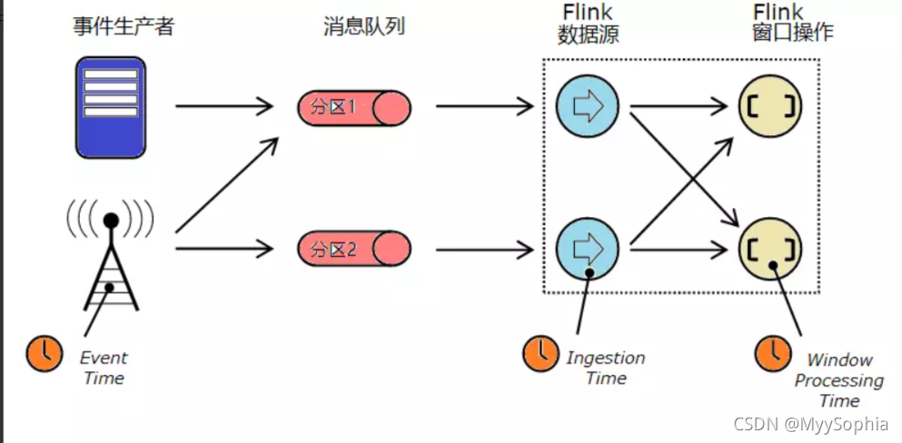
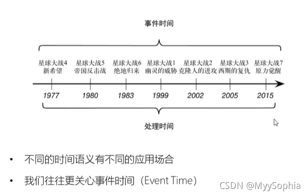
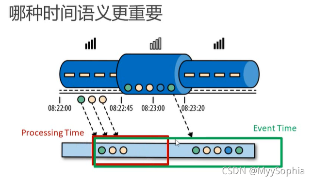

#flink的TimeCharacteristic



env.setStreamTimeCharacteristic(TimeCharacteristic.EventTime);
此处可以取以下三类值：

* Event Time

事件时间，事件(Event)本身的时间，即数据流中事件实际发生的时间，通常使用事件发生时的时间戳来描述，这些事件的时间戳通常在进入流处理应用之前就已经存在了，事件时间反映了事件真实的发生时间。所以，基于事件时间的计算操作，其结果是具有确定性的，无论数据流的处理速度如何、事件到达算子的顺序是否会乱，最终生成的结果都是一样的。

* Ingestion Time

摄入时间，事件进入Flink的时间，即将每一个事件在数据源算子的处理时间作为事件时间的时间戳，并自动生成水位线(watermarks,关于watermarks下文会详细分析)。

Ingestion Time从概念上讲介于Event Time和Processing Time之间。与Processing Time相比 ，它的性能消耗更多一些，但结果却更可预测。由于 Ingestion Time使用稳定的时间戳（在数据源处分配了一次），因此对记录的不同窗口操作将引用相同的时间戳，而在Processing Time中每个窗口算子都可以将记录分配给不同的窗口。

与Event Time相比，Ingestion Time无法处理任何乱序事件或迟到的数据，即无法提供确定的结果，但是程序不必指定如何生成水位线。在内部，Ingestion Time与Event Time非常相似，但是可以实现自动分配时间戳和自动生成水位线的功能。

* Processing Time

处理时间，根据处理机器的系统时钟决定数据流当前的时间，即事件被处理时当前系统的时间。还以窗口算子为例(关于window，下文会详细分析)，基于处理时间的窗口操作是以机器时间来进行触发的，由于数据到达窗口的速率不同，所以窗口算子中使用处理时间会导致不确定的结果。在使用处理时间时，无需等待水位线的到来后进行触发窗口，所以可以提供较低的延迟。

举一个实际的例子：



站在看电影的普通大众来说肯定是关心电影的上映时间；也就是处理时间 也就是processTime

站在研究电影剧情的人来说肯定关心的是电影整个系列的故事发展，应该先看1999的星球大战1....也就是eventTime。

另外再看一个例子：



eventTime 是追求数据准，接受一定的延迟

processTime是追求快，容忍数据存在一定的偏差

flink默认使用eventTime

实例
```
package demo;
import org.apache.commons.compress.utils.Lists;
import org.apache.flink.api.common.functions.AggregateFunction;
import org.apache.flink.api.common.serialization.SimpleStringSchema;
import org.apache.flink.api.common.state.ListState;
import org.apache.flink.api.common.state.ListStateDescriptor;
import org.apache.flink.api.java.tuple.Tuple;
import org.apache.flink.configuration.Configuration;
import org.apache.flink.streaming.api.TimeCharacteristic;
import org.apache.flink.streaming.api.datastream.DataStream;
import org.apache.flink.streaming.api.environment.StreamExecutionEnvironment;
import org.apache.flink.streaming.api.functions.KeyedProcessFunction;
import org.apache.flink.streaming.api.functions.timestamps.AscendingTimestampExtractor;
import org.apache.flink.streaming.api.functions.windowing.WindowFunction;
import org.apache.flink.streaming.api.windowing.time.Time;
import org.apache.flink.streaming.api.windowing.windows.TimeWindow;
import org.apache.flink.streaming.connectors.kafka.FlinkKafkaConsumer;
import org.apache.flink.util.Collector;

import java.sql.Timestamp;
import java.util.ArrayList;
import java.util.Comparator;
import java.util.Properties;

/**
* 本来从kafka接收商品信息数据，每隔五分钟统计最近一小时的热门商品top 5.
*      商品信息字段名：userId itemId categoryId behavior timestamp
* 一个商品pv次数越多，热度越高。
*
* 分析：
*      步骤1：分组开窗聚合，得到每个窗口各个商品pv的count值：
*          先把"behavior=pv"的数据过滤出来，然后按照商品id即itemId分组。
*          有一个滑动窗口操作，长度一小时，步长5分钟。
*          要对每个itemId的pv做聚合，且聚合后数据类型改变，应该使用aggregate函数
*          aggregate函数中第一个参数为增量聚合函数，利用累加器累加状态后将状态输出
*          因为需要按窗口统计，所以需要获取到窗口的信息，所以aggregate函数必须有第二个参数，即一个全窗口函数
*          全窗口函数中负责将itemId,windowEnd,count_pv封装并输出。
*
*      步骤2：收集同一窗口内所有商品的count值，排序输出top 5
*          top 5是每个窗口中的，所以肯定需要先按windowEnd分组
*          窗口内的数据何时全部到达呢？当事件时间到达watermark时，全部数据都已到达，然后触发计算。
*          已达到但未触发计算的数据可以保存在ListState中，但数据全部到达时除法定时器计算逻辑输出结果。
*          因为用到了定时器和状态，所以必须使用processFunction api.
*          定时器：
*              每来一条数据，就将该数据加入listState,然后就根据数据中带有的windowEnd时间戳注册定时器，时间戳相同，定时器就是同一个。
*              在onTimer方法中，取出listState中的数据然后排序即可。
*              注意：
*                  定时器触发后应该在onTimer方法中调用clear方法清除状态。
*                  在close方法中也应该调用clear方法清除状态。
*/
public class HotItems {
public static void main(String[] args) throws Exception {
//创建环境
StreamExecutionEnvironment env = StreamExecutionEnvironment.getExecutionEnvironment();
env.setParallelism(1);
//wx 2021年10月11日16:48:33 EventTime是以数据自带的时间戳字段为准，应用程序需要指定如何从record中抽取时间戳字段，此处对应的是csv中的最后一个字段 - 行为发生的时间戳
//其他两个取值是:
// 1. ProcessingTime是以operator处理的时间为准，它使用的是机器的系统时间来作为data stream的时间；
// 2. IngestionTime是以数据进入flink streaming data flow的时间为准；

        env.setStreamTimeCharacteristic(TimeCharacteristic.EventTime);
 
        /**
         * 读取数据并转换成pojo，按事件时间处理就必须先分配时间戳和watermark
         * 要想kafka从头开始消费时数据，group.id必须是全新的，消费策略必须是earliest
         */
        Properties ps = new Properties();
        ps.setProperty("bootstrap.servers","192.168.149.131:9092");//集群地址
        ps.setProperty("group.id", "consumer_group");//消费者组
        ps.setProperty("key.deserializer", "org.apache.kafka.common.serialization.StringDeserializer");//key反序列化方式
        ps.setProperty("value.deserializer", "org.apache.kafka.common.serialization.StringDeserializer");//value反序列化方式
        ps.setProperty("auto.offset.reset","earliest");//消费策略
        //其实第二个参数指定了序列化方式，那key和value的序列化方式就不用指定了
        DataStream <String> inputStream=env.addSource(new FlinkKafkaConsumer<String>("hotitems_test",new SimpleStringSchema(),ps));
        DataStream<UserBehavior> dataStream=inputStream.map(
                line ->{
                    String [] words=line.split(",");
                    return new UserBehavior(new Long(words[0]),new Long(words[1]),new Integer(words[2]),new String(words[3]),new Long(words[4]));
                })
                .assignTimestampsAndWatermarks(
                        new AscendingTimestampExtractor<UserBehavior>() { //升序
                            @Override
                            public long extractAscendingTimestamp(UserBehavior userBehavior) {//获取事件时间戳，秒级转毫秒级
                                return userBehavior.getTimestamp()*1000L;
                            }
                        });
 
        //分组聚合得到结果数据
        DataStream<ItemViewCount> aggStream=dataStream
                .filter(data -> "pv".equals(data.getBehavior())) //过滤“pv”行为
                .keyBy(UserBehavior::getItemId)
                .timeWindow(Time.minutes(60),Time.minutes(5)) //每5分钟更新一次1小时窗口数据
                .aggregate(new ItemCountAgg(),new WindowItemCountResult());
 
        //收集同一窗口所有商品的count数据，按top 5输出
        DataStream resultDs=aggStream
                .keyBy("windowEnd")
                .process(new TopNItems(5));
 
 
 
        //输出并执行
        resultDs.print("每隔五分钟最近一小时前五的热门商品");
        env.execute("hot items analysis");
    }
 
 
    //泛型1:输入类型   泛型2:聚合状态类型   泛型3:输出类型
    public static class ItemCountAgg implements AggregateFunction<UserBehavior,Long,Long>{
 
        @Override
        public Long createAccumulator() {//创建累加器并给初始值
            return 0L;
        }
 
        @Override
        public Long add(UserBehavior userBehavior,Long accumulator) {//每次计算累加器加一,并返回新的累加器值
            return accumulator+1;
        }
 
        @Override
        public Long getResult(Long accumulator) {//累加器最终给外部返回的值
            return accumulator;
        }
 
        @Override
        public Long merge(Long a, Long b) { //合并两个累加器，返回合并后的累加器的状态，这儿用不到.用不到.
            return a+b;
        }
    }
 
    //参数1：输入类型  参数2：输出类型  参数3：keyBy的返回值键值对中value的类型  参数4： 窗口类型
    public static class WindowItemCountResult implements WindowFunction<Long,ItemViewCount, Long, TimeWindow>{
 
        @Override
        public void apply(Long key, TimeWindow window, Iterable<Long> iterable, Collector<ItemViewCount> collector) throws Exception {
            //包装成一个ItemViewCount对象输出
            collector.collect(new ItemViewCount(key.longValue(),window.getEnd(),iterable.iterator().next()));
        }
    }
 
    //参数1：keyBy返回值类型  参数2：输入类型  参数3：输出类型
    public static class TopNItems extends KeyedProcessFunction<Tuple,ItemViewCount,String>{
        private Integer topSize;
        private ListState<ItemViewCount> listState; //列表状态，保存当前窗口所有输出的ItemViewCount
 
        public TopNItems(Integer topSize) {
            this.topSize = topSize;
        }
 
        @Override
        public void open(Configuration parameters) throws Exception {
            listState =getRuntimeContext().getListState(new ListStateDescriptor<ItemViewCount>("item-view-count-list",ItemViewCount.class));
        }
 
        //每来一条数据如何处理
        @Override
        public void processElement(ItemViewCount value, Context context, Collector<String> collector) throws Exception {
            //每来一条数据，存入List中，并注册定时器（只有触发时间一样，定时器就是同一个）
            listState.add(value);
            context.timerService().registerEventTimeTimer(value.getWindowEnd());
        }
 
        //定时器触发时的逻辑
        @Override
        public void onTimer(long timestamp, OnTimerContext ctx, Collector<String> out) throws Exception {
            //转换成Arraylist再排序
            ArrayList<ItemViewCount> itemViewCounts = Lists.newArrayList(listState.get().iterator());
 
            itemViewCounts.sort(new Comparator<ItemViewCount>() {
                @Override
                public int compare(ItemViewCount o1, ItemViewCount o2) {//前-后小于0，为倒序
                    if(o1.getCount() > o2.getCount())
                        return -1;
                    else if (o1.getCount() == o2.getCount())
                        return 0;
                    else
                        return 1;
                }
            });
 
            //定义输出结果格式
            StringBuilder resultBuilder=new StringBuilder();
            resultBuilder.append("===================\n");
            resultBuilder.append("窗口结束时间：").append(new Timestamp(timestamp)).append("\n"); //输出windowend
 
            //遍历输出
            for (int i = 0; i < Math.min(topSize,itemViewCounts.size()); i++) {
                ItemViewCount currentItemViewCount = itemViewCounts.get(i);
                resultBuilder.append("Number").append(i+1).append(":")
                        .append("商品ID：").append(currentItemViewCount.getItemId())
                        .append("浏览量：").append(currentItemViewCount.getCount())
                        .append("\n");
            }
 
            resultBuilder.append("===================\n\n");
 
            Thread.sleep(1000L);//控制输出频率
            out.collect(resultBuilder.toString());
            listState.clear();//清空状态
 
        }
 
        @Override
        public void close() throws Exception {
            listState.clear();//清空状态
        }
    }
}
```
这里消费kafka的时候setStreamTimeCharacteristic为TimeCharacteristic.EventTime

* flink的TimeCharacteristic枚举定义了三类值，分别是ProcessingTime、IngestionTime、EventTime
* ProcessingTime是以operator处理的时间为准，它使用的是机器的系统时间来作为data stream的时间；IngestionTime是以数据进入flink streaming data flow的时间为准；EventTime是以数据自带的时间戳字段为准，应用程序需要指定如何从record中抽取时间戳字段
* 指定为EventTime的source需要自己定义event time以及emit watermark，或者在source之外通过assignTimestampsAndWatermarks在程序手工指定
